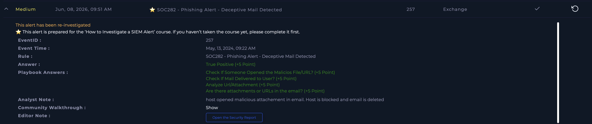

# SOC282 - Phishing Alert - Deceptive Mail Detected

**Platform:** LetsDefend  
**Date:** Jun 08, 2026  
**Severity:** Medium  
**Type:** Exchange / Phishing  
**Verdict:** True Positive ✅

---

## Alert Details

| Field | Value |
|---|---|
| EventID | 257 |
| Event Time | May 13, 2024, 09:22 AM |
| Rule | SOC282 - Phishing Alert - Deceptive Mail Detected |
| Type | Exchange |

---

## Investigation Steps

### Step 1 - Check Attachments and URLs
Analyzed email content for malicious attachments and URLs.  
**Result:** Malicious attachment identified in email.

### Step 2 - Check If Mail Was Delivered
Verified whether the phishing email reached the user's inbox.  
**Result:** Email was delivered to user.

### Step 3 - Analyze URL/Attachment
Analyzed the malicious attachment using threat intelligence tools.  
**Result:** Attachment confirmed malicious.

### Step 4 - Check If Someone Opened the File
Investigated endpoint logs to determine if user opened the attachment.  
**Result:** Host opened the malicious attachment.

---

## Actions Taken
- Malicious email deleted
- Affected host blocked
- Incident escalated for further investigation

---

## Analyst Note
Host opened malicious attachment in email. Host is blocked and 
email is deleted.

---

## Verdict
**True Positive** - User opened malicious email attachment. 
Host was immediately blocked to prevent further damage.

---

## Lessons Learned
Always verify in endpoint logs whether the user actually opened 
the attachment before making a verdict. First attempt resulted 
in incorrect False Positive classification because log check 
was skipped. Correct workflow: check delivery → check if opened 
→ then make verdict.

## Screenshot

