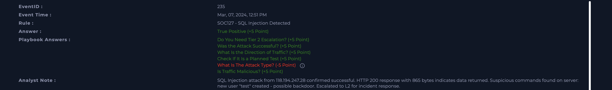

# SOC127 - SQL Injection Detected

**Platform:** LetsDefend  
**Date:** Jun 09, 2026  
**Severity:** High  
**Type:** Web Attack  
**Verdict:** True Positive ✅

---

## Alert Details

| Field | Value |
|---|---|
| EventID | 235 |
| Event Time | Mar 07, 2024, 12:51 PM |
| Rule | SOC127 - SQL Injection Detected |
| Source IP | 118.194.247.28 |
| Destination IP | 172.16.20.12 |
| Destination Host | WebServer1000 / atlanta-server |
| HTTP Response | 200 - 865 bytes |
| Device Action | Allowed |

---

## Malicious URL
"GET /?douj=3034 AND 1=1 UNION ALL SELECT 1,NULL,
'',table_name 
FROM information_schema.tables WHERE 2>1; 
EXEC xp_cmdshell('cat ../../../etc/passwd')"

Attack contained three techniques in single request:
- SQL Injection (UNION SELECT)
- XSS attempt
- Command execution via xp_cmdshell

---

## Investigation Steps

### Step 1 - Is Traffic Malicious?
Checked source IP 118.194.247.28 on VirusTotal and AbuseIPDB.  
**Result:** IP belongs to China Unicom Beijing. Confirmed malicious.

### Step 2 - Check If Planned Test
Searched mailbox for any penetration test notifications for 
WebServer1000 or source IP.  
**Result:** No emails found. Not a planned test.

### Step 3 - Traffic Direction
Source: 118.194.247.28 (external)  
Destination: 172.16.20.12 (internal server)  
**Result:** Internet → Company Network

### Step 4 - Was Attack Successful?
Checked Command History on atlanta-server via Endpoint Security.  
**Suspicious commands found:**
- `useradd -m test` - new user created
- `passwd test` - password set for new user
- `vi proxy.conf` - config file modified
- `whoami` - attacker checked current user

HTTP 200 response with 865 bytes suggests data was returned.  
**Result:** Attack appears successful - backdoor account created.

### Step 5 - Tier 2 Escalation
Based on successful attack and backdoor creation, escalated to L2.  
**Result:** Escalated for full incident response.

---

## Artifacts

| Type | Value | Notes |
|---|---|---|
| IP Address | 118.194.247.28 | Source - China Unicom, malicious |
| IP Address | 172.16.20.12 | Destination - internal web server |
| Hostname | WebServer1000 / atlanta-server | Compromised server |
| Username | test | Backdoor account created by attacker |
| URL | /?douj=3034%20AND%201%3D1... | SQL Injection payload |

---

## Analyst Note

SQL Injection attack from 118.194.247.28 confirmed successful. 
HTTP 200 response with 865 bytes indicates data returned. 
Suspicious commands found on server: new user "test" created - 
possible backdoor. Escalated to L2 for incident response.

---

## Verdict
**True Positive** - Successful SQL Injection attack with system 
compromise. Backdoor account created on target server.

---

## Recommended Actions
- Isolate atlanta-server immediately
- Delete backdoor user account "test"
- Review and restore proxy.conf
- Block IP 118.194.247.28 on firewall
- Full forensic investigation of server

---

## Lessons Learned
The malicious URL contained three attack techniques simultaneously: 
SQL Injection, XSS, and command execution via xp_cmdshell.

**Initial mistake:** I classified this as XSS attack instead of 
SQL Injection. The rule name "SQL Injection Detected" defines the 
primary attack type, even when the payload contains additional 
techniques. SQL Injection was the main vector - XSS was embedded 
within the SQL payload.

**Key takeaway:** Always use the rule name and primary attack vector 
to classify the incident type, not secondary techniques found in payload.

HTTP 200 with significant response bytes (865) combined with suspicious 
Command History is strong evidence of successful attack. Always check 
both indicators together before making verdict.

## Screenshot

