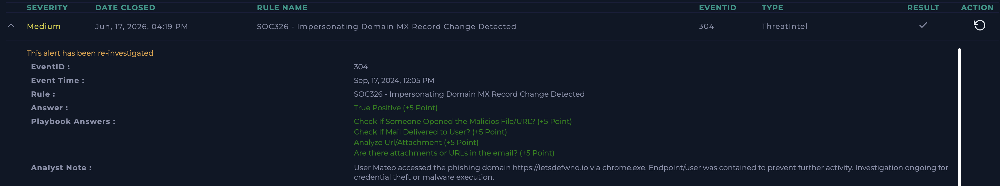

SOC326 - Impersonating Domain MX Record Change Detected

Platform: LetsDefend
Date: Jun 17, 2026
Severity: Medium
Type: ThreatIntel
Verdict: True Positive ✅

⸻

Alert Details

Field	Value
EventID	304
Event Time	Sep 17, 2024, 12:05 PM
Rule	SOC326 - Impersonating Domain MX Record Change Detected
Type	ThreatIntel
Suspicious Domain	letsdefwnd.io
MX Record	mail.mailerhost.net

⸻

Investigation Steps

Step 1 - Analyze Alert Context

Reviewed the alert indicating an MX record change on a suspicious domain impersonating the legitimate company domain.

Result: Domain letsdefwnd.io was identified as a typosquatting domain attempting to impersonate letsdefend.io.

Step 2 - Check Email Delivery

Investigated email logs to determine whether phishing emails from the impersonating domain reached internal users.

Result: Email logs confirmed a message sent from voucher@letsdefwnd.io to mateo@letsdefend.io.

Step 3 - Search for User Interaction

Reviewed proxy and endpoint logs for evidence of user interaction with the malicious domain.

Result: User Mateo accessed https://letsdefwnd.io using chrome.exe.

Step 4 - Network Traffic Analysis

Analyzed connection details associated with the malicious URL access.

Result: HTTPS connection to destination IP 45.33.23.183 over port 443 was allowed.

Step 5 - Determine Potential Impact

Evaluated whether the phishing email and subsequent URL access could lead to credential theft or malware execution.

Result: User interaction with the phishing domain was confirmed, indicating potential risk of credential compromise.

Step 6 - Containment

Performed containment actions to prevent additional malicious activity.

Result: The affected user endpoint was contained and investigation proceeded for possible credential theft or malware execution.

⸻

Indicators of Compromise (IOCs)

Type	Value
Domain	letsdefwnd.io
URL	https://letsdefwnd.io
Destination IP	45.33.23.183
Sender Email	voucher@letsdefwnd.io
Recipient Email	mateo@letsdefend.io
User	Mateo
Host IP	172.16.17.162

⸻

Actions Taken

* Confirmed delivery of phishing email from impersonating domain
* Verified user access to the malicious URL
* Contained affected user endpoint
* Documented all identified IOCs
* Continued investigation for signs of credential theft or malware execution

⸻

Analyst Note

User Mateo accessed the phishing domain https://letsdefwnd.io via chrome.exe. The endpoint/user was contained immediately to prevent further malicious activity.

⸻

Verdict

True Positive – A typosquatting domain impersonating letsdefend.io delivered a phishing email to an internal user. The user subsequently accessed the malicious URL and the affected endpoint was contained to mitigate potential compromise.

⸻

Lessons Learned

Typosquatting domains often imitate legitimate organizations by registering visually similar domains and modifying infrastructure components such as MX records to facilitate phishing campaigns. Monitoring for domain impersonation and correlating email telemetry with web access logs enables analysts to quickly determine whether users interacted with malicious infrastructure and to initiate containment before further compromise occurs.

Screenshot

