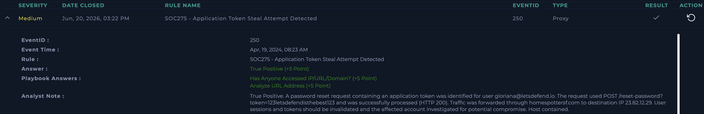

SOC275 - Application Token Steal Attempt Detected

Platform: LetsDefend
Date: Jun 20, 2026
Severity: Medium
Type: Proxy
Verdict: True Positive ✅

⸻

Alert Details

Field	Value
EventID	250
Event Time	Apr 19, 2024, 08:23 AM
Rule	SOC275 - Application Token Steal Attempt Detected
Type	Proxy
Hostname	Gloriana
Host IP	172.16.17.172
Affected User	gloriana@letsdefend.io
Trigger Request	GET /reset-password?email=gloriana@letsdefend.io HTTP/1.1
Device Action	Redirect

⸻

Investigation Steps

Step 1 - Review Alert Context

Reviewed the proxy alert indicating a potential application token theft attempt involving a password reset request.

Result: The alert was triggered by access to a password reset endpoint associated with user gloriana@letsdefend.io.

Step 2 - Analyze Proxy Logs

Investigated web proxy logs to determine whether additional suspicious requests were made.

Result: A subsequent request was identified:

POST /reset-password?token=123letsdefendisthebest123 HTTP/1.1

The request contained a password reset token and was successfully processed.

Step 3 - Analyze Request Details

Reviewed request metadata and destination information.

Result: Traffic originated from host Gloriana (172.16.17.172) and was forwarded to destination IP 23.82.12.29 on port 8081 through homespottersf.com.

Step 4 - Determine Potential Impact

Assessed whether the identified activity could result in account compromise.

Result: The presence of a reset token within the request and successful server response (HTTP 200) indicated a potential password reset token abuse attempt and possible account takeover risk.

Step 5 - Investigate User and Infrastructure Exposure

Verified whether the suspicious destination had been accessed and whether additional indicators were present.

Result: Communication with the external infrastructure was confirmed and the destination domain and IP were documented as indicators of compromise.

Step 6 - Containment

Performed containment measures to prevent unauthorized account access.

Result: The affected host was contained and account sessions and tokens were invalidated pending further investigation.

⸻

Indicators of Compromise (IOCs)

Type	Value
User	gloriana@letsdefend.io
Hostname	Gloriana
Host IP	172.16.17.172
Destination IP	23.82.12.29
Domain	homespottersf.com
URL Path	/reset-password
Reset Token	123letsdefendisthebest123

⸻

Actions Taken

* Confirmed access to the password reset endpoint
* Identified POST request containing a password reset token
* Verified successful processing of the request (HTTP 200)
* Documented external infrastructure and associated IOCs
* Contained the affected host
* Recommended invalidation of active sessions and reset tokens

⸻

Analyst Note

True Positive. A password reset request containing an application token was identified for user gloriana@letsdefend.io. The request used POST /reset-password?token=123letsdefendisthebest123 and was successfully processed (HTTP 200). Traffic was forwarded through homespottersf.com to destination IP 23.82.12.29. The affected host was contained and account sessions and tokens should be invalidated pending further investigation.

⸻

Verdict

True Positive – Proxy logs confirmed a password reset request containing an application token that was successfully processed by the application. The activity indicated a potential password reset token abuse attempt and possible account takeover scenario. The affected host was contained and remediation actions were initiated.

⸻

Lessons Learned

Application reset tokens are highly sensitive artifacts and can be abused to gain unauthorized access to user accounts. Monitoring requests to password recovery endpoints, especially those containing reset tokens, helps identify potential account takeover attempts. Analysts should investigate the origin of such requests, validate whether tokens were used successfully, and invalidate active sessions and reset tokens immediately when suspicious activity is confirmed.

Screenshot

