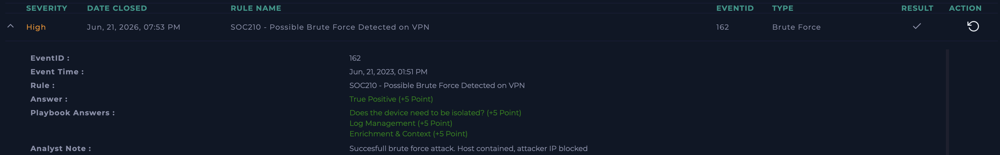

# SOC210 - Possible Brute Force Detected on VPN

**Platform:** LetsDefend  
**Date:** Jun 21, 2026  
**Severity:** High  
**Type:** Brute Force  
**Role:** Tier 2 (verification of L1 escalation)  
**Verdict:** True Positive ✅

---

## Alert Details

| Field | Value |
|---|---|
| EventID | 162 |
| Event Time | Jun 21, 2023, 01:51 PM |
| Source IP | 37.19.221.229 |
| Destination | 33.33.33.33 (Hostname: Mane) |
| Username | mane@letsdefend.io |
| Trigger | Successful VPN login shortly after multiple failed attempts |

**L1 Note (pre-filled):**
*"Checked authentication logs, saw many login failures from the same 
IP, attempting different usernames. Successful login looks suspicious 
after these failed attempts."*

---

## What I Did (Tier 2 verification)

Confirmed source IP is external.

Checked IP reputation on VirusTotal - 1/91 detections, flagged as 
suspicious.

Searched Log Management for the attacker IP - all requests were on 
port 443 (HTTPS/VPN), not SSH or RDP. Confirmed this was a VPN brute 
force attempt, not SSH/RDP based.

Confirmed scope - same attacker IP tried multiple usernames before 
successfully logging in as mane@letsdefend.io.

---

## Verdict
**True Positive** - Successful brute force attack on VPN. Attacker 
tried multiple usernames, eventually got valid credentials for 
mane@letsdefend.io.

---

## Analyst Note
Successful brute force attack. Host contained, attacker IP blocked.

---

## Notes on This Case
This alert came with a pre-filled L1 analyst note, meaning my role was 
Tier 2 - verifying and confirming L1's findings rather than starting 
analysis from scratch. Faster to complete than pure L1 alerts because 
the initial investigation was already done. Good example of how L1 
and L2 roles differ in a real SOC workflow.

## Screenshot

