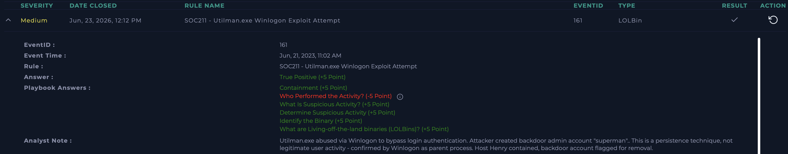

# SOC211 - Utilman.exe Winlogon Exploit Attempt

**Platform:** LetsDefend  
**Date:** Jun 23, 2026  
**Severity:** Medium  
**Type:** LOLBin  
**Verdict:** True Positive ✅

---

## Alert Details

| Field | Value |
|---|---|
| EventID | 161 |
| Event Time | Jun 21, 2023, 11:02 AM |
| Hostname | Henry |
| Process | Utilman.exe |
| Parent Process | Winlogon.exe |
| Command Line | net user superman onepunch123 /add |
| Trigger Reason | Command Launched from Winlogon |
| Device Action | Allowed |

---

## What I Did

**Identified the binary:** Utilman.exe - a legitimate Windows "Ease of 
Access" tool, normally accessible from the login screen before any 
user authentication.

**Determined suspicious activity:** Utilman.exe should never trigger 
a `net user ... /add` command. This command line creates a new admin 
account ("superman") - not a normal function of this binary.

**Checked parent process:** Winlogon.exe as parent confirms this was 
triggered from the login screen, before any user logged in. This 
matches the classic "Utilman backdoor" technique, where the binary 
is replaced to spawn a privileged command shell from the lock screen.

**Determined who performed the activity:** Concluded this was 
attacker-driven, but the correct answer was "User" - because LOLBin 
attacks are defined as a human attacker manually abusing a legitimate 
system tool, not automated malware running on its own.

---

## Verdict
**True Positive** - Attacker exploited Utilman.exe via the login 
screen to bypass authentication and create a persistent backdoor 
admin account.

---

## Analyst Note
Utilman.exe abused via Winlogon to bypass login authentication. 
Attacker created backdoor admin account "superman". This is a 
persistence technique, not legitimate user activity - confirmed by 
Winlogon as parent process. Host Henry contained, backdoor account 
flagged for removal.

---

## Lessons Learned
Made a mistake on "Who performed the activity" - answered "Malware" 
instead of "User". 

**Key lesson:** LOLBin (Living-off-the-Land Binary) attacks are by 
definition manual techniques performed by a human attacker using 
legitimate system tools to avoid antivirus detection - not automated 
malicious code. When the question asks "who performed this," think 
"a person typing commands through a backdoor," not "self-running 
malware."

---

## Screenshot

