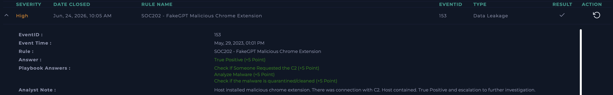

# SOC202 - FakeGPT Malicious Chrome Extension

**Platform:** LetsDefend  
**Date:** Jun 24, 2026  
**Severity:** High  
**Type:** Data Leakage  
**Verdict:** True Positive ✅

---

## Alert Details

| Field | Value |
|---|---|
| EventID | 153 |
| Event Time | May 29, 2023, 01:01 PM |
| Hostname | Samuel |
| File | hacfaophiklaeolhnmckojjjjbnappen.crx |
| File Path | C:\Users\LetsDefend\Download\ |
| Command Line | chrome.exe --single-argument [malicious .crx file] |
| Device Action | Allowed |

---

## What I Did

Checked the host IP - clean reputation, nothing unusual there.

Checked the file hash on VirusTotal - confirmed malicious. This is a 
fake Chrome extension (.crx file) impersonating an AI/ChatGPT tool, 
known as "FakeGPT" - a real malware family that steals browser data 
and session tokens once installed.

Defined threat indicator as "unknown or unexpected outgoing internet 
traffic" - since browser extensions like this typically communicate 
with a C2 server to exfiltrate stolen data.

Checked Endpoint Security and Log Management for quarantine status - 
no evidence the malware was cleaned or blocked automatically.

Checked Log Management for connections to the malware's known C2 
address - found evidence of access, confirming the extension was 
actively communicating with the attacker's server.

---

## Verdict
**True Positive** - Malicious Chrome extension installed and 
successfully communicated with its C2 server, indicating active 
data exfiltration risk.

---

## Analyst Note
Host installed malicious chrome extension. There was connection with 
C2. Host contained. True Positive and escalation to further 
investigation.

---

## Notes on This Case
FakeGPT is a real malware family - fake browser extensions that 
impersonate AI tools like ChatGPT to trick users into installing them, 
then steal session cookies, browsing data, and credentials. Good 
reminder that malware delivery isn't limited to email attachments or 
downloaded executables - browser extensions are an increasingly common 
attack vector.

## Screenshot

