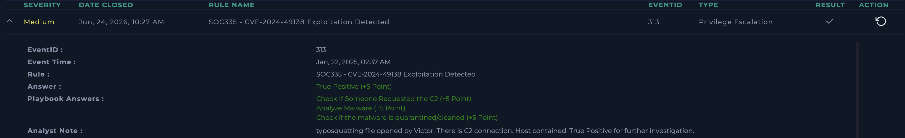

# SOC335 - CVE-2024-49138 Exploitation Detected

**Platform:** LetsDefend  
**Date:** Jun 24, 2026  
**Severity:** Medium  
**Type:** Privilege Escalation  
**Verdict:** True Positive ✅

---

## Alert Details

| Field | Value |
|---|---|
| EventID | 313 |
| Event Time | Jan 22, 2025, 02:37 AM |
| Hostname | Victor |
| Process Name | svohost.exe |
| Process Path | C:\temp\service_installer\svohost.exe |
| Parent Process | powershell.exe |
| Device Action | Allowed |

---

## What I Did

Checked the file hash on VirusTotal - confirmed Trojan.

Noticed the process name "svohost.exe" - a typosquatted version of the 
legitimate Windows process "svchost.exe". The letters are swapped 
(svo vs svc) to trick a quick glance into thinking it's a normal 
system process.

Also noticed the file path: C:\temp\service_installer\ - real 
svchost.exe is always located in C:\Windows\System32\, never in temp 
folders. This confirmed the file was fake.

Checked Endpoint Security and Log Management for quarantine status - 
no evidence the malware was cleaned automatically.

Checked Log Management for C2 communication - found reconnaissance 
commands (whoami, etc.) executed by the user account on host Victor, 
confirming the malware was active and the attacker had gained some 
level of access.

---

## Verdict
**True Positive** - Trojan disguised as a legitimate Windows process 
(typosquatting technique) was executed and established C2 
communication.

---

## Analyst Note
Typosquatting file opened by Victor. There is C2 connection. Host 
contained. True Positive for further investigation.

---

## Notes on This Case
Key lesson: always compare suspicious process names character-by-
character against the legitimate system process. "svohost.exe" vs 
"svchost.exe" is a subtle one-letter swap designed to pass a quick 
visual check. Combined with an unusual file path (C:\temp instead of 
System32), this is a strong indicator of malware impersonating a 
trusted system binary.

---

## Screenshot

