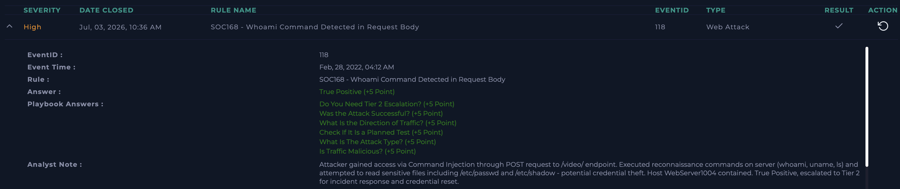

# SOC168 - Whoami Command Detected in Request Body

**Platform:** LetsDefend  
**Date:** Jul 03, 2026  
**Severity:** High  
**Type:** Web Attack  
**Verdict:** True Positive ✅

---

## Alert Details

| Field | Value |
|---|---|
| EventID | 118 |
| Hostname | WebServer1004 |
| Source IP | 61.177.172.87 |
| Method | POST /video/ |
| User-Agent | MSIE 6.0 / Windows XP (suspicious - spoofed) |

---

## What I Did

Source IP was suspicious on VirusTotal (3 engines). Also flagged the 
User-Agent - IE6 on Windows XP in 2022 is a red flag, likely a 
scanner or exploit tool.

Checked Command History on WebServer1004 - found post-exploitation 
activity starting at 04:12 AM matching the alert time:
- `whoami`, `uname`, `ls` - recon
- `cat /etc/passwd` and `cat /etc/shadow` - credential theft attempt

Attack clearly succeeded. Contained the host and escalated.

---

## Analyst Note
Attacker gained access via Command Injection through POST request 
to /video/ endpoint. Executed recon commands and read /etc/passwd 
and /etc/shadow - potential credential theft. Host contained, 
escalated to Tier 2 for incident response and credential reset.

---

## Lessons Learned
Spoofed User-Agent (ancient browser version) is a quick indicator 
of automated attack tools. Always check Command History when 
Command Injection is suspected - that's where you confirm if the 
attack actually worked.

## Screenshot

